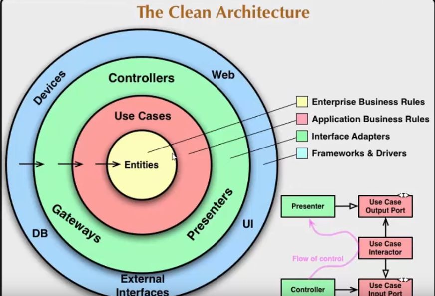

# Repositório projeto Clean Architecture
## Pré requisitos
- VSCode https://code.visualstudio.com/download
- S.O Linux

### Comandos para instalar .NET SDK 7.0 no Ubuntu
```bash
wget https://packages.microsoft.com/config/ubuntu/22.04/packages-microsoft-prod.deb -O packages-microsoft-prod.deb
sudo dpkg -i packages-microsoft-prod.deb
rm packages-microsoft-prod.deb

sudo apt install dotnet-sdk-7.0
```
### Comandos para criar as pastas do projeto no padrão de Clean Architecture
```bash
mkdir CleanArchitecture && cd CleanArchitecture
dotnet new sln -n CleanArchitecture
mkdir src && cd src/ && mkdir Core && mkdir Infrastructure && mkdir Presentation
cd Core/ && dotnet new classlib -o CleanArchitecture.Application && dotnet new classlib -o CleanArchitecture.Domain && cd CleanArchitecture.Domain/ && mkdir Entities && mkdir Interfaces && cd ..
cd ..  && cd Infrastructure/  &&  dotnet new classlib -o CleanArchitecture.Persistence && cd CleanArchitecture.Persistence/ && mkdir Context && mkdir Repositories && cd ..
cd .. &&  cd Presentation/ && dotnet new webapi -o CleanArchitecture.WebAPI
cd .. && cd .. && mkdir tests
cd tests && dotnet new xunit -o CleanArchitecture.UnitTests && cd ..
cd tests && dotnet new xunit -o CleanArchitecture.IntegrationTests && cd ..
cd tests && dotnet new xunit -o CleanArchitecture.FunctionalTests && cd ..
```
### Comandos para adicionar os projetos a solution
```bash
dotnet sln add src/Infrastructure/CleanArchitecture.Persistence
dotnet sln add src/Core/CleanArchitecture.Application
dotnet sln add src/Core/CleanArchitecture.Domain
dotnet sln add src/Presentation/CleanArchitecture.WebAPI
dotnet sln add tests/CleanArchitecture.UnitTests
```
### Comandos para adicionar os projetos como referência
```bash
dotnet add ./src/Core/CleanArchitecture.Application/CleanArchitecture.Application.csproj reference ./src/Core/CleanArchitecture.Domain/CleanArchitecture.Domain.csproj
dotnet add ./src/Infrastructure/CleanArchitecture.Persistence/CleanArchitecture.Persistence.csproj reference ./src/Core/CleanArchitecture.Application/CleanArchitecture.Application.csproj
dotnet add ./src/Presentation/CleanArchitecture.WebAPI/CleanArchitecture.WebAPI.csproj reference ./src/Core/CleanArchitecture.Application/CleanArchitecture.Application.csproj
dotnet add ./src/Presentation/CleanArchitecture.WebAPI/CleanArchitecture.WebAPI.csproj reference ./src/Infrastructure/CleanArchitecture.Persistence/CleanArchitecture.Persistence.csproj
```

## Build & Run - ambiente Local

```bash
dotnet build CleanArchitecture.sln

dotnet run --project ./src/Presentation/CleanArchitecture.WebAPI/CleanArchitecture.WebAPI.csproj
```

### Comando para criar arquivo padrão do gitignore
```bash
dotnet new gitignore
```

## Screenshots




## Tech Stack

**Server:** .NET


### Fonte
https://youtu.be/luyGoZa9is4